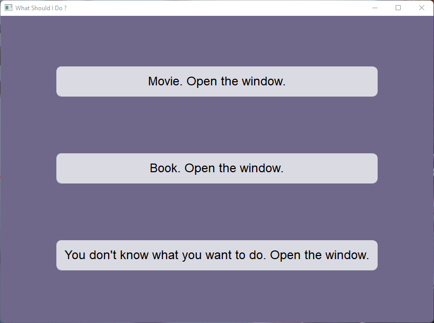
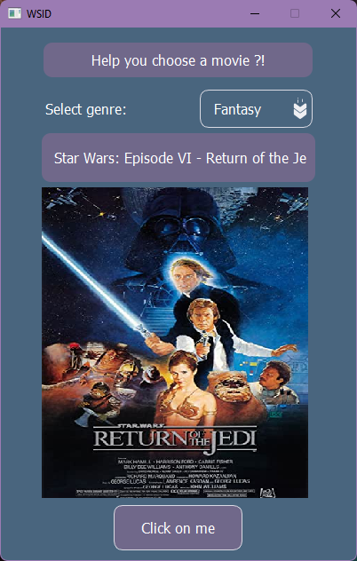
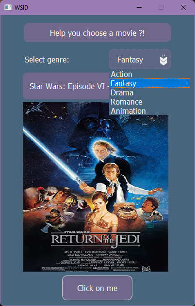

# CS50-Final-Project
### Description:

*Introduction:*

WSID is a gui application for boring evenings when you do not know what to do. The application will give you the opportunity not to think about what to watch or what to read today if you want to occupy yourself with something new This is also not a problem the application will tell you what to do yourself. All we need to know what to do is to click on two buttons and the program will give the result without any effort 
How does it work?
We have a file which generates our data and after we formulate the data, it is sent to the main application which already generates it for the user. From there you can see how the user sees this data.
When the user enters the applications we see the main screen which has only 3 buttons



*How it works:*

The "movie" button allows you to dive into the world of movies and choose something for yourself. By clicking on the genre button you will be able to select one of the presented genres:
The "Book" button button will help you choose a book to spend a pleasant evening with. You can also choose the genre you are interested in:
The last button will help you choose something new for you, maybe it's time for you to choose a new hobby




In order to run the program you need to perform a few small steps:
```
git clone 
pip install -r requirements.txt
```
*Let's go through the code:*

-project.py is the file where the data is formulated. In this file, the desired data from json is converted into a dictionary and passed for further work with it. 
This file also has a third party API which also fetches the data.

The files are used to draw the application:

1. myWIn.py - main window
2. movieUi.py - movie window
3. bookUi.py - book window
4. hobbyUi.py - window for choosing a hobby
5. main.py - all other logic inside PYQT happens in this file. The data from project.py is passed here for further manipulation and transmitted to the user when a certain signal is given (a button pressed)

### I hope you enjoy my project 🙂

